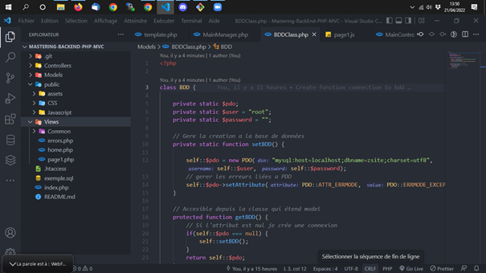

<div id="top"></div>

<div align="center">
  <h1> Mastering Back End | PHP POO MVC</h1>
  <p> Lessons about MVC with PHP</p>
</div>

***

### Table of Content
1. [General Info](#general-info)
3. [Visual](#visual)
4. [Technologies](#technologies)
5. [Installation](#installation)
6. [Contributing](#contributing)
7. [Contact](#contact)
<p align="right">(<a href="#top">back to top</a>)</p>

***

### General Info
Create a professional basic structure of a site in PHP.<br>
Reminders on MVC :<br>
- Router: Allows to make the association between user requests and site logic 
- Controller: Allows you to control the client request to find the necessary data and transmit it to the view. It coordinates what needs to be put in place to return the result
- View: Displays the requested pages using the data transmitted by the controller
- Model: Allows you to retrieve the data requested by the controller
<p align="right">(<a href="#top">back to top</a>)</p>

***

### Visual
Here is an overview of project. </br>
</br>
<div align="center">
  
</div>
<p align="right">(<a href="#top">back to top</a>)</p>

***

### Technologies
- PHP
- MVC

<p align="right">(<a href="#top">back to top</a>)</p>

***

### Installation

1. Clone the project
```
git clone https://github.com/LiseRochat/Mastering-BackEnd-PHP-MVC
```
2. Open file with you text editor 
3. Create database name **zsite**
4. Import exemple.sql file
5. Run : **loclahost/http://localhost/Mastering-BackEnd-PHP-MVC/accueil**
<p align="right">(<a href="#top">back to top</a>)</p>

***

### Contributing
If you have a suggestion that would make this better, please fork the repository and create a pull request. You can also simply open an issue with the tag "enhancement".

Don't forget to give the project a star! Thanks again!

1. Fork the Project
2. Create your Feature Branch (`git checkout -b feature/AmazingFeature`)
3. Commit your Changes (`git commit -m 'Add some AmazingFeature'`)
4. Push to the Branch (`git push origin feature/AmazingFeature`)
5. Open a Pull Request
<p align="right">(<a href="#top">back to top</a>)</p>

***

### Contact 
Rochat Lise - liserochat@live.fr </br>
Project Link: [https://github.com/LiseRochat/Mastering-BackEnd-PHP-MVC](https://github.com/LiseRochat/Mastering-BackEnd-PHP-MVC)
<br>
<p align="right">(<a href="#top">back to top</a>)</p>


